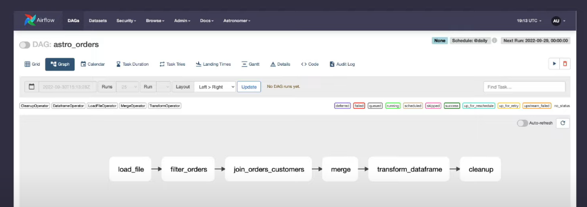

Python SDK for rapid developement of extract, transform, and load workflows in Apache Airflow
# Pipeline 


# Prerequest
- Astro CLI
- Docker

# Configuration & Set up
In terminal:
```
astro dev init
```

In requirement.txt:
```
astro-sdk-python[amazon, snowflake] >= 1.1.0
```

In .env:
```
AIRFLOW__CORE__ENABLE_XCOM_PICKLING=True
AIRFLOW__ASTRO_SDK__SQL_SCHEMA=ASTRO_SDK_SCHEMA
```

In terminal:
```
astro dev start
```

View DAGs in localhost:/8080 admin admin UI

# Dataset & S3
Create include/data/orders_data_header.csv:
```
order_id,customer_id,purchase_date,amount
ORDER1,CUST1,1/1/2021,100
ORDER2,CUST2,2/2/2022,200
ORDER3,CUST3,3/3/2023,300
```

Upload data to S3 bucket: s3://aprilwang-astrosdk/oders_data_header.csv

IAM -> Users -> astro-sdk Access Key - Programmatic access -> AdminAccess -> *Save Access key Id & Secret access key*

# Snowflake Tables & Dataset
```sql
CREATE DATABASE ASTRO_SDK_DB;
CREATE WAREHOUSE ASTRO_SDK_DW;
CREATE SCHEMA ASTRO_SDK_SCHEMA;
```
Create customer & reporting table
``` sql
CREATE OR REPLACE TABLE customers_table (customer_id CHAR(10), customer_name VARCHAR(100), type VARCHAR(10) );

INSERT INTO customers_table (CUSTOMER_ID, CUSTOMER_NAME,TYPE) VALUES     ('CUST1','NAME1','TYPE1'),('CUST2','NAME2','TYPE1'),('CUST3','NAME3','TYPE2');

CREATE OR REPLACE TABLE reporting_table (
    CUSTOMER_ID CHAR(30), CUSTOMER_NAME VARCHAR(100), ORDER_ID CHAR(10), PURCHASE_DATE DATE, AMOUNT FLOAT, TYPE CHAR(10));

INSERT INTO reporting_table (CUSTOMER_ID, CUSTOMER_NAME, ORDER_ID, PURCHASE_DATE, AMOUNT, TYPE) VALUES
('INCORRECT_CUSTOMER_ID','INCORRECT_CUSTOMER_NAME','ORDER2','2/2/2022',200,'TYPE1'),
('CUST3','NAME3','ORDER3','3/3/2023',300,'TYPE2'),
('CUST4','NAME4','ORDER4','4/4/2022',400,'TYPE2');
CREATE OR REPLACE TABLE customers_table (customer_id CHAR(10), customer_name VARCHAR(100), type VARCHAR(10) );
```

# Connections
AWS
- connection_id: aws_default
- connection_type: AWS_S3
- extra: {"aws_access_key_id": "", "aws_secret_access_key": ""}

SF
- connection_id: snowflake_default
- connection_type: Snowflake
- host
- Schema: ASTRO_SDK_SCHEMA
- Login: username
- Password
- Account
- Warehouse: ASTRO_SDK_DW
- Database: ASTRO_SDK_DB
- Region: ap-south-1
- Role: ACCOUNTADMIN

# dags/astro_orders.py
```python
from datetime import datetime

from airflow.models import DAG
from pandas import DataFrame

from astro import sql as aql
from astro.files import File
from astro.sql.table import Table

S3_FILE_PATH = 's3://marcl-astrosdk'
S3_CONN_ID = 'aws_default'
SNOWFLAKE_CONN_ID = 'snowflake_default'
SNOWFLAKE_ORDERS = 'orders_table'
SNOWFLAKE_FILTERED_ORDERS = 'filtered_table'
SNOWFLAKE_JOINED = 'joined_table'
SNOWFLAKE_CUSTOMERS = 'customer_table'
SNOWFLAKE_REPORTING = 'reporting_table'

## A decorator that allows users to run SQL queries natively in Airflow
@aql.transform 
def filter_order(input_table: Table):
  return "SELECT * FROM {{input_table}} WHERE amount > 150"

@aql.transform
def join_orders_customers(filtered_orders_table: Table, customer_table: Table):
  return """SELECT c.customer_id, customer_name, order_id, purchase_date, amount, type
FROM {{filterd_orders_table}} f JOIN {{customer_table}} c
ON f.customer_id = c.customer_id
"""

## Dataframe operator allows you to run Python transformations in Airflow
@aql.dataframe
def transfrom_dataframe(df: DataFrame):
  purchase_dates = df.loc[:, "purchase_dates"]
  print("purchase dates:", purchase_dates)
  return purchase_dates

with DAG(dag_id='astro_orders',
         start_date=datetime(2022,1,1),
         schedule='@daily',
         catchup=False):
    order_data = aql.load_file(
      input_file=File(
          path=S3_FILE_PATH+"/orders_data_header.csv",
          conn_id=S3_CONN_ID
      ),
      output_table=Table(conn_id=SNOWFLAKE_CONN_ID)
    )

    customers_table = Table(
      name=SNOWFLAKE_CUSOMTER,
      conn_id=SNOWFLAKE_CONN_ID,
    )

    joined_data = join_orders_customer(filer_orders(orders_data), customer_table)
    ## Insert rows from the source SQL table into the destination SQL table, depending on conflicts
    reporting_table = aql.merge(
      target_table=Table(
        name=SNOWFLAKE_REPORTING,
        conn_id=SNOWFLAKE_CONN_ID,)
      source_table=joined_data,
      target_conflict_columns=["order_id"],
      columns=["cusomter_id", "customer_name"],
      if_conflicts="update",
    )

    purchase_dates = transform_dataframe(reporting_table)
    ## The cleanup operator allows you to clean up temporary tables(Tables) created as part of your Astro SDK pipeline
    purchase_dates >> aql.cleanup()
```


