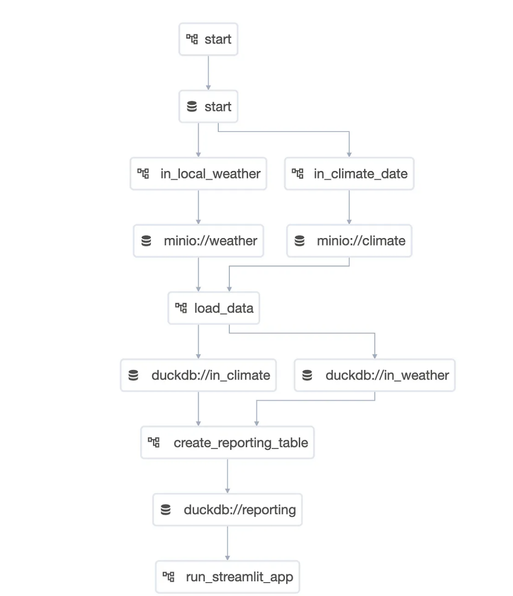

Page: https://medium.com/apache-airflow/elt-with-airflow-a-no-install-click-and-play-blueprint-project-running-in-codespaces-1b92c1713569

Code: https://github.com/TJaniF/airflow-elt-blueprint

Read two data sets locally into Minio and upload to DuckDB, creating report and publish to streamlit App

