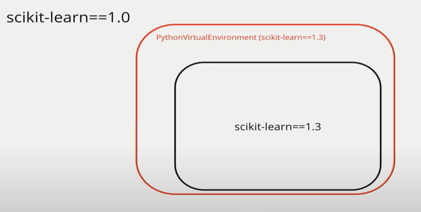

The ExternalPythonOperator: No more dependency conflicts in Apache Airflow
https://www.youtube.com/watch?v=mWQa5mWpMZ4

instance with scikit-learn==1.0, task needs scikit-learn==1.3

Options:
- run KubernetesPodOperator
- run docker operator: run on its own docker with dependencies that won't impact your instance
- run PythonVirtualenv Operator
- Run ExternalPythonOperator



PythonVirtualEnvOperator vs ExternalPythonOperator
- PythonVirtualEnvOperator will have a big setup that every time the task is run
- ExternalPythonOpertor is fast to run

In Dockerfile:
```
RUN python -m venv yfiance_venv && source yfiance_venv/bin/activate && \
    pip install --no-catche-dir yfiance==0.2.27 && deactivate
```

Dag.py
```python
from  airflow.decorators import dag, task
from datetime import datetime
import yfinance as yf

@dag(
  start_date=datetime(2023,1,1)
  schedule=None,
  catchup=False,
  tags=['example']
)

def my_simple_dag():
  @task
  def extract_stock_new_yfiance():
    print(yf.download("AAPL", start="2020-12-01", end="2020-12-31"))
    appl = yf.Ticker("AAPL")
    appl.get_shared_full(start="2020-12-01", end="2020-12-31")

  # with new yfiance==0.2.27 it has the get_shared_full() funtion
  @task.external_python(python='/usr/local/airflow/yfinance_venv/bin/python')
  def extract_stock_new_yfiance():
    print(yf.download("AAPL", start="2020-12-01", end="2020-12-31"))
    appl = yf.Ticker("AAPL")
    appl.get_shared_full(start="2020-12-01", end="2020-12-31")
extract_stock_old_yfiance()
extract_stock_new_yfiance()
simple_dag()
```

In terminal to test:
- astro dev bash
- airflow tasks test my_simple_dag extract_stock_old_yfiance
- source yfinance_venv/bin/activate
